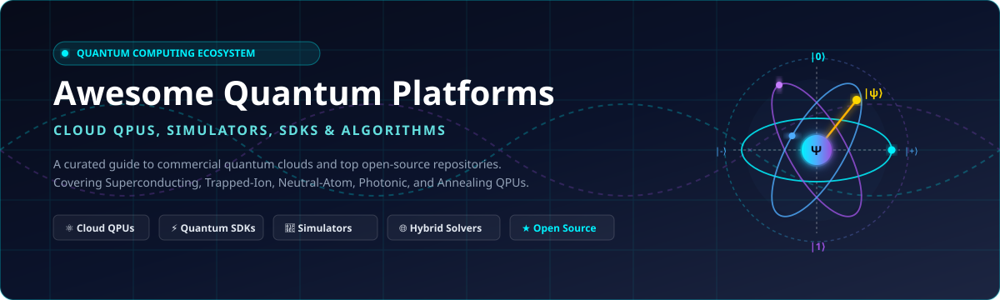

  

# ⚛️ Awesome Quantum Computing Platform

  
  
  
    
  

## 🌌 Top Quantum Computing Platforms Ecosystem
**A Curated Directory of Quantum SaaS Cloud Services, QPUs, Simulators & Open-Source Software Development Kits (SDKs)**  
*Covering Superconducting, Trapped-Ion, Neutral-Atom, Photonic, Annealing Hardware, Fault-Tolerant Quantum Computing (FTQC) & Hybrid Classical-Quantum Algorithms.*  
**Last updated: September 2026**

---

### 🔍 Overview & SEO Highlights
Welcome to the authoritative directory of **quantum computing cloud platforms** and **open-source quantum software libraries**. Whether you are benchmarking **quantum processing units (QPUs)**, running variational quantum algorithms (VQE / QAOA), exploring quantum error correction (QEC), or orchestrating multi-cloud quantum workflows across IBM, Azure, AWS, and specialized hardware vendors, this guide provides verified pricing, free tier quotas, company valuations, and stargazers metrics.

- **Primary Topics**: Quantum Computing, Quantum Cloud Platforms, QPUs, Quantum Software Development Kits (SDKs), NISQ, Fault-Tolerant Quantum Computing, Hybrid Algorithms, Quantum Simulators.
- **Hardware Modalities**: Superconducting Qubits, Trapped Ions, Neutral Cold Atoms, Silicon Spin Qubits, Photonic Quantum Computing, Quantum Annealers.

---

## 📑 Table of Contents
- [☁️ SaaS/Hosted Quantum Platforms](#-saashosted-quantum-platforms)
  - [Market Size & Industry Structure](#-market-size--industry-structure)
  - [SaaS Platforms Comparison Table](#-saas-platforms-comparison-table)
- [💻 Open-Source Quantum Projects](#-open-source-quantum-projects)
  - [Core Open-Source Repositories (Ranked by Stars)](#-core-open-source-repositories-ranked-by-stars)
  - [Architectural Workflow & Developer Recommendations](#-architectural-workflow--developer-recommendations)
- [📈 Star History](#-star-history)
- [🤝 How to Contribute](#-how-to-contribute)
- [⚠️ Disclaimer](#-disclaimer)

---

## ☁️ SaaS/Hosted Quantum Platforms

### 📊 Market Size & Industry Structure
> **Sector Economics & Structure (2025–2026):** The global Quantum Computing Cloud Platform and QPU Access market is currently estimated at **$1.3 Billion to $1.8 Billion** and projected to surge past **$8.5 Billion to $12+ Billion by 2032** (CAGR ~32–38%). The sector exhibits a **hybrid structure**: it is **highly fragmented** across heterogeneous physical hardware modalities and specialized software layers (superconducting, trapped-ion, neutral-atom, photonic, annealing, and compilation layers), yet **concentrated at the cloud brokerage layer** where hyperscalers (Microsoft Azure Quantum, AWS Braket, IBM Quantum) dominate multi-backend enterprise distribution.

### 📋 SaaS Platforms Comparison Table
*Sorted in descending order by parent company size (Market Capitalization / Corporate Valuation / Revenue).*

| Platform | Description | Company Size / Valuation | Pricing | Free Tier Limits |
| :--- | :--- | :--- | :--- | :--- |
| **[Azure Quantum](https://azure.microsoft.com/en-us/products/quantum)** | Microsoft's enterprise multi-provider quantum cloud delivering integrated hardware (IonQ, Quantinuum, Rigetti, Pasqal), hybrid coprocessors, and Azure Quantum Development Kit. | **~$3.1 Trillion Market Cap** (Microsoft parent; ~$245B+ annual revenue) | Pay-as-you-go per provider: Rigetti from $0.02/10ms execution; IonQ from $0.00022/1q-gate-shot + $0.000975/2q-gate-shot ($12.42–$97.50 min/exec); Pasqal from €3,000/QPU-hr | $500 free Azure Quantum credit for each participating provider (valid across first-time workspace usage) + free full local/web simulators & Resource Estimator; Azure account free trial grants $200 credits for 30 days |
| **[Amazon Braket](https://aws.amazon.com/braket/)** | AWS fully managed quantum computing service providing access to diverse QPUs (IonQ, IQM, QuEra, Rigetti) and cloud-hosted Jupyter environments. | **~$2.0 Trillion Market Cap** (Amazon parent; ~$575B+ annual revenue) | Pay-as-you-go: $0.30 per task + per-shot fees (Rigetti Cepheus: $0.000425/shot, IQM Garnet: $0.00145/shot, QuEra Aquila: $0.01/shot, IonQ Forte: $0.08/shot); SV1/DM1 simulators at $0.075/minute | AWS Free Tier: 1 hour (60 minutes) of on-demand simulation time (SV1, DM1, TN1) per month for the first 12 months; local SDK simulator is completely free forever |
| **[IBM Quantum](https://www.ibm.com/quantum)** | Premier utility-scale superconducting quantum cloud platform powering global enterprise workloads with native Qiskit Runtime primitives. | **~$215 Billion Market Cap** (IBM parent; ~$62B+ annual revenue) | Starts at $1.60/second ($96/minute) on Pay-As-You-Go Plan; Flex Plan starts at $72/minute (min 400 min/yr); Premium Plan starts at $48/minute (min 5,200 min/yr) | Open Plan: 10 minutes of quantum computer runtime per month forever; free access to simulators & learning resources |
| **[D-Wave Leap](https://www.dwavesys.com/learn/leap/)** | Commercial quantum annealing and hybrid solver cloud system designed for combinatorial optimization, logistics, and materials discovery. | **~$380 Million Market Cap** (NYSE: QBTS; ~$10M–$15M annual revenue) | Starts at $109/month for Developer Plan (includes 15 minutes of hybrid solver time or 10 seconds of QPU time per month); Enterprise subscriptions available | Free permanent Developer access with 1 minute (60 seconds) of QPU time or hybrid solver compute per month upon connecting a verified GitHub account (otherwise 1 month free trial with 1 minute of QPU time) |
| **[Pasqal Cloud](https://www.pasqal.com/)** | Full-stack neutral-atom quantum computing cloud platform for analog simulation, graph optimization, and digital quantum computation. | **~$320 Million Valuation** (€140M+ venture funding raised from Temasek, EIC, etc.) | On-demand access starts at €3,000 per QPU-hour; €15 per emulator-hour (EMU-MPS / EMU-SV) via cloud integrations (Azure / Pasqal Cloud) | 30-day free sandbox access on Pasqal Cloud emulator with 20 free emulator-hours for testing neutral-atom Pulser programs |
| **[Rigetti QCS](https://www.rigetti.com/)** | Quantum Cloud Services platform delivering low-latency, ultra-fast classical-quantum co-processing for superconducting QPUs via Forest SDK. | **~$300 Million Market Cap** (NASDAQ: RGTI; ~$12M–$15M annual revenue) | Starts at $0.02 per 10-millisecond increment of job execution time (~$1.20/minute of pure QPU time); reservations from $4,100/hour | Free forever Quantum Virtual Machine (QVM) simulation via pyQuil and Forest SDK; initial free test credit granted for new QCS accounts (or through Azure $500 Rigetti credits) |
| **[IQM Resonance](https://www.meetiqm.com/)** | European leader in on-premise and cloud superconducting quantum systems, providing direct algorithmic execution on Garnet and Emerald QPUs. | **~$280 Million Valuation** (€150M+ raised from institutional & European funds) | Pay-per-second / reservation starting at ~€2,000–€3,000/hour (~$0.30/task + $0.00145/shot via public cloud marketplaces) | 14-day free trial on Resonance cloud simulator and demo QPUs with up to 1 hour of simulated runtime credit |
| **[Classiq](https://www.classiq.io/)** | High-level algorithmic synthesis platform automating the transformation of functional quantum algorithms into optimized gate-level hardware circuits. | **~$180 Million Valuation** ($63M+ raised; backed by Samsung NEXT, SoftBank, HSBC) | Team / Enterprise tier starting from ~$1,500/month or custom annual contracts depending on synthesized circuit complexity and seats | Community Edition: Free forever with unlimited high-level model creation, circuit synthesis up to 50 qubits, and execution on cloud simulators |
| **[Q-CTRL Fire Opal](https://q-ctrl.com/fire-opal)** | Quantum control infrastructure software delivering automated algorithmic error suppression, dynamical decoupling, and AI-driven gate optimization. | **~$150 Million Valuation** ($54M+ raised; backed by Airbus Ventures, Morpheus, Salesforce) | Fire Opal Pro starting at $500/month; native pay-as-you-go add-on on IBM Quantum Platform starting at $1.60/runtime-minute | Free tier available forever: execute circuits up to 20 qubits with basic automated error suppression on public hardware backends |
| **[Quantum Inspire](https://www.quantum-inspire.com/)** | European research cloud platform from QuTech offering direct remote access to both spin-qubit and superconducting chip backends with open emulators. | **~$55 Million Public/Institutional Backing** (QuTech, TNO, and TU Delft consortium) | Commercial / partner custom reservations start from €500–€2,500/hour for dedicated hardware access slots | Free forever account: access to hardware backends (Spin-2+, Starmon-5) with a maximum of 3 queued jobs at a time; unlimited access to QI cloud simulators (up to 31 qubits) |

---

## 💻 Open-Source Quantum Projects

Quantum computing boasts one of the most vibrant open-source ecosystems in technology. Below is a curated list of top open-source repositories spanning software development kits, quantum machine learning (QML), compilers, error mitigation, and high-performance simulators.

### 🌟 Core Open-Source Repositories (Ranked by Stars)
*Sorted in descending order by GitHub stargazers count.*

1. **[Qiskit](https://github.com/Qiskit/qiskit)**   
   The industry-standard open-source SDK created by IBM for working with quantum computers at the level of pulses, circuits, and application modules. Includes advanced synthesis, transpilation, and runtime primitives.

2. **[Cirq](https://github.com/quantumlib/Cirq)**   
   Google Quantum AI's Python library for writing, manipulating, and optimizing NISQ (Noisy Intermediate-Scale Quantum) circuits, with specialized calibration and hardware-level native gate targeting.

3. **[PennyLane](https://github.com/PennyLaneAI/pennylane)**   
   A cross-platform Python library developed by Xanadu for quantum machine learning, automatic differentiation, and hybrid classical-quantum computing across PyTorch, TensorFlow, and JAX.

4. **[TorchQuantum](https://github.com/mit-han-lab/torchquantum)**   
   A PyTorch-centric library developed by the MIT Han Lab for quantum circuit simulation, quantum machine learning, noise-aware quantum architecture search (QAS), and quantum AI applications.

5. **[PyQuil](https://github.com/rigetti/pyquil)**   
   Rigetti Computing’s Python library for quantum programming using the Quil instruction language, interacting with the Forest SDK, Quantum Virtual Machine (QVM), and Rigetti QPUs.

6. **[CUDA-Q](https://github.com/NVIDIA/cuda-quantum)**   
   NVIDIA's open-source unified programming model and compiler platform for hybrid quantum-classical computing, enabling high-performance GPU-accelerated simulation and tight QPU-GPU co-processing.

7. **[Yao.jl](https://github.com/QuantumBFS/Yao.jl)**   
   An extensible, highly efficient quantum simulation framework written entirely in Julia, offering differentiable quantum circuits, tensor network contractions, and hardware acceleration.

8. **[Q# / Quantum Development Kit](https://github.com/microsoft/qsharp)**   
   Microsoft's domain-specific programming language and toolchain engineered for quantum algorithm expression, resource estimation, and scalable fault-tolerant application design.

9. **[ProjectQ](https://github.com/ProjectQ-Framework/ProjectQ)**   
   An open-source quantum software framework originally from ETH Zurich featuring an extensible compiler engine, high-level algorithm synthesis, and multiple hardware export targets.

10. **[Stim](https://github.com/quantumlib/Stim)**   
    Google Quantum AI's hyper-fast stabilizer circuit simulator designed specifically for quantum error correction (QEC) research, surface codes, and syndrome extraction benchmarks.

11. **[Qiskit Aer](https://github.com/Qiskit/qiskit-aer)**   
    The high-performance simulator backend framework for Qiskit written in C++ with GPU and tensor-network acceleration, providing realistic noisy channel and statevector models.

12. **[D-Wave Ocean SDK](https://github.com/dwavesystems/dwave-ocean-sdk)**   
    A suite of open-source Python tools for solving NP-hard combinatorial optimization, Quadratic Unconstrained Binary Optimization (QUBO), and Ising models on D-Wave quantum annealers.

13. **[Mitiq](https://github.com/unitaryfoundation/mitiq)**   
    An open-source compiler by the Unitary Fund for quantum error mitigation (QEM), implementing Zero-Noise Extrapolation (ZNE), Probabilistic Error Cancellation (PEC), and Clifford data regression across any backend.

14. **[TKET](https://github.com/Quantinuum/tket)**   
    Quantinuum's advanced quantum compiler providing state-of-the-art circuit routing, peephole optimization, phase gadget reduction, and hardware-agnostic retargeting.

15. **[OpenQAOA](https://github.com/entropicalabs/openqaoa)**   
    Entropica Labs' multi-backend Python SDK dedicated to designing, testing, and optimizing Quantum Approximate Optimization Algorithm (QAOA) workflows on NISQ devices and classical simulators.

---

### 🛠️ Architectural Workflow & Developer Recommendations
1. **Circuit Modeling & Transpilation**: Use **Qiskit** or **Cirq** for gate-level circuit composition. For multi-backend optimization, pass circuits through **TKET** or **Classiq** to reduce 2-qubit CNOT/CZ gate depth and match physical topology constraints.
2. **Machine Learning & AI Integration**: Leverage **PennyLane** or **TorchQuantum** when connecting parameter-dependent quantum circuits to PyTorch or JAX neural networks.
3. **Quantum Error Mitigation (QEM)**: Enhance experimental execution fidelity on noisy physical backends by wrapping jobs with **Mitiq** (open-source) or **Q-CTRL Fire Opal** (automated cloud infrastructure).
4. **Error Correction Benchmarks**: Use **Stim** for simulating millions of syndrome extraction rounds on topological and surface codes at ultra-high throughput.
5. **Execution Orchestration**: Simulate locally with **Qiskit Aer** or **CUDA-Q** before dispatching to managed cloud queues via **IBM Quantum**, **Azure Quantum**, or **Amazon Braket**.

---

## 📈 Star History

---

## 🤝 How to Contribute
We welcome contributions from researchers, quantum software engineers, and hardware teams worldwide!
1. **Fork the repository** to your own GitHub account.
2. **Create a branch** for your addition (`git checkout -b add-my-platform`).
3. **Ensure exact details**:
   - For **SaaS platforms**: Provide official links, concrete starting prices, explicit free tier limits/trial durations, and company size/valuation metrics.
   - For **Open-source projects**: Provide clean repository URLs and official stargazers badges (`style=social` and `color=white`).
4. **Submit a Pull Request** with a concise description of the new resource.

---

## ⚠️ Disclaimer
- This repository is a **community-curated research directory** and does not constitute financial, investment, or enterprise procurement advice.
- Quantum hardware architectures, qubit counts, fidelities ($T_1$, $T_2$, 2-qubit gate error rates), and cloud pricing tiers evolve rapidly. Always check the official documentation of individual providers prior to deploying production workloads.

---

  Maintained by <a href="https://github.com/ishandutta2007">ishan-dutta</a> &bull; Dedicated to advancing open, reproducible, and accessible quantum computation.

